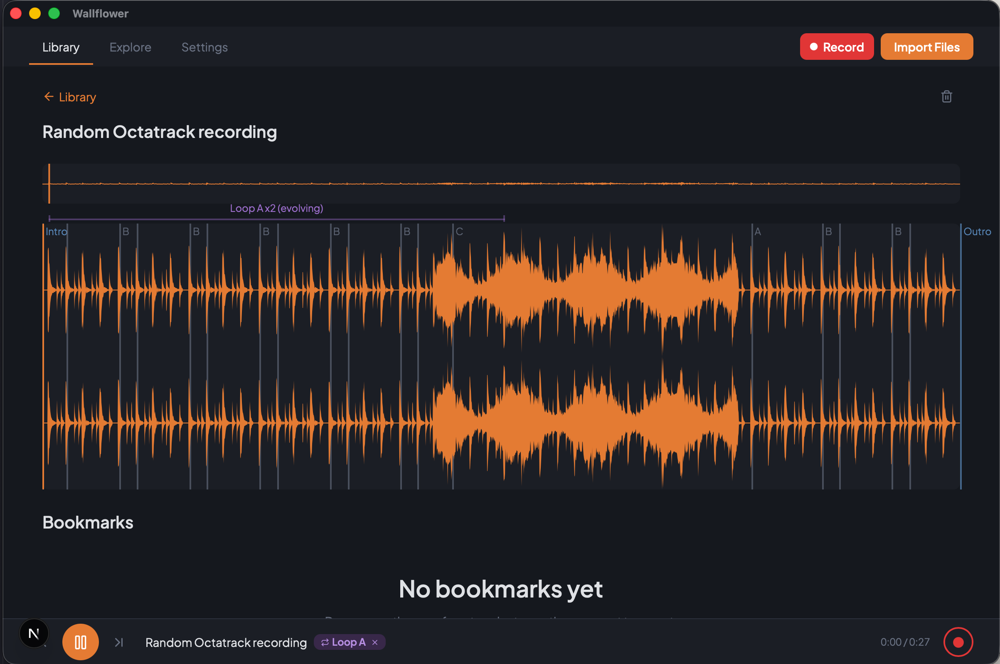

# Wallflower

A local-first jam and sample manager for musicians who want to focus on creating music, not managing files. Wallflower records, imports, analyzes, and organizes musical explorations -- using local AI to automatically detect structure, separate sources, and tag metadata -- so you can quickly go from "I just finished a 2-hour jam" to "here's the interesting 8-bar synth loop in Bb minor at 120bpm" with minimal effort.



## Download

**[Wallflower v0.2.0](https://github.com/lovettbarron/wallflower/releases/tag/v0.2.0)** -- macOS (Apple Silicon). Code-signed and notarized.

## Status

**v0.2.0 released** -- Import, playback, recording, ML analysis, source separation, spatial explorer, accessibility, sample browser, and export.

## Installation

### Pre-built (recommended)

Download the latest DMG from the [Releases page](https://github.com/lovettbarron/wallflower/releases). Open it and drag Wallflower to Applications. Requires macOS 13.0+ on Apple Silicon.

### Build from Source

**Prerequisites:** macOS, Rust toolchain ([rustup.rs](https://rustup.rs)), Node.js 20+, protobuf (`brew install protobuf`)

### Clone and Build

```bash
git clone https://github.com/lovettbarron/wallflower.git
cd wallflower
npm install
cargo build --workspace
```

### Run the App

```bash
# Development mode (Tauri app with hot reload)
cargo tauri dev

# Or run just the CLI
cargo run -p wallflower-cli -- help
```

## CLI Usage

```
wallflower import <path>     Import a file or directory
wallflower list              List all jams in the library
wallflower list --format json    Output as JSON
wallflower status            Show app status (jam count, watcher, storage)
wallflower settings          View all settings
wallflower settings <key>    View a specific setting
wallflower settings <key> <value>   Update a setting
wallflower devices           List connected audio recording devices
```

### Examples

```bash
# Import a recording from a Zoom F3
wallflower import /Volumes/ZOOM\ F3/STEREO/ZOOM0001.WAV

# Import an entire directory
wallflower import ~/Desktop/jam-session/

# Check what devices are connected
wallflower devices

# See library status
wallflower status
```

## Architecture

Wallflower is a Tauri v2 native macOS application with three Rust crates:

```
crates/
  wallflower-core/    Core library: database, import pipeline, settings,
                      folder watcher, device detection
  wallflower-app/     Tauri application: IPC commands, HTTP API, app state
  wallflower-cli/     CLI binary: git-style subcommands sharing wallflower-core
```

**Storage:** SQLite database at `~/Library/Application Support/wallflower/wallflower.db`. Audio files copied to `~/Library/Application Support/wallflower/audio/`.

**Frontend:** React/Next.js static export served in a Tauri WKWebView. Communicates with the Rust backend via Tauri IPC commands and an HTTP API on port 23516.

**Watch folder:** Default `~/wallflower`. New audio files are automatically imported after a 5-second debounce period.

## Development

```bash
# Run all tests
cargo test --workspace

# Run core library tests only
cargo test -p wallflower-core

# Run app in development mode
cargo tauri dev

# Build frontend static export
npm run build

# Release build
cargo build --release --workspace
```

## License

MIT

## Links

- [andrewlb.com](https://andrewlb.com)
- [Project Repository](https://github.com/lovettbarron/wallflower)
